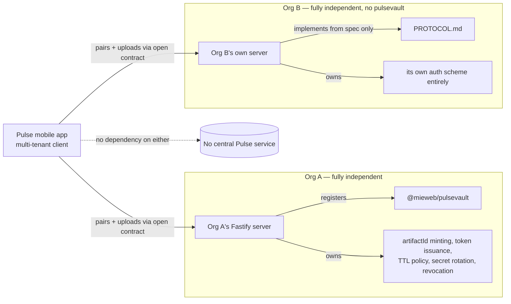
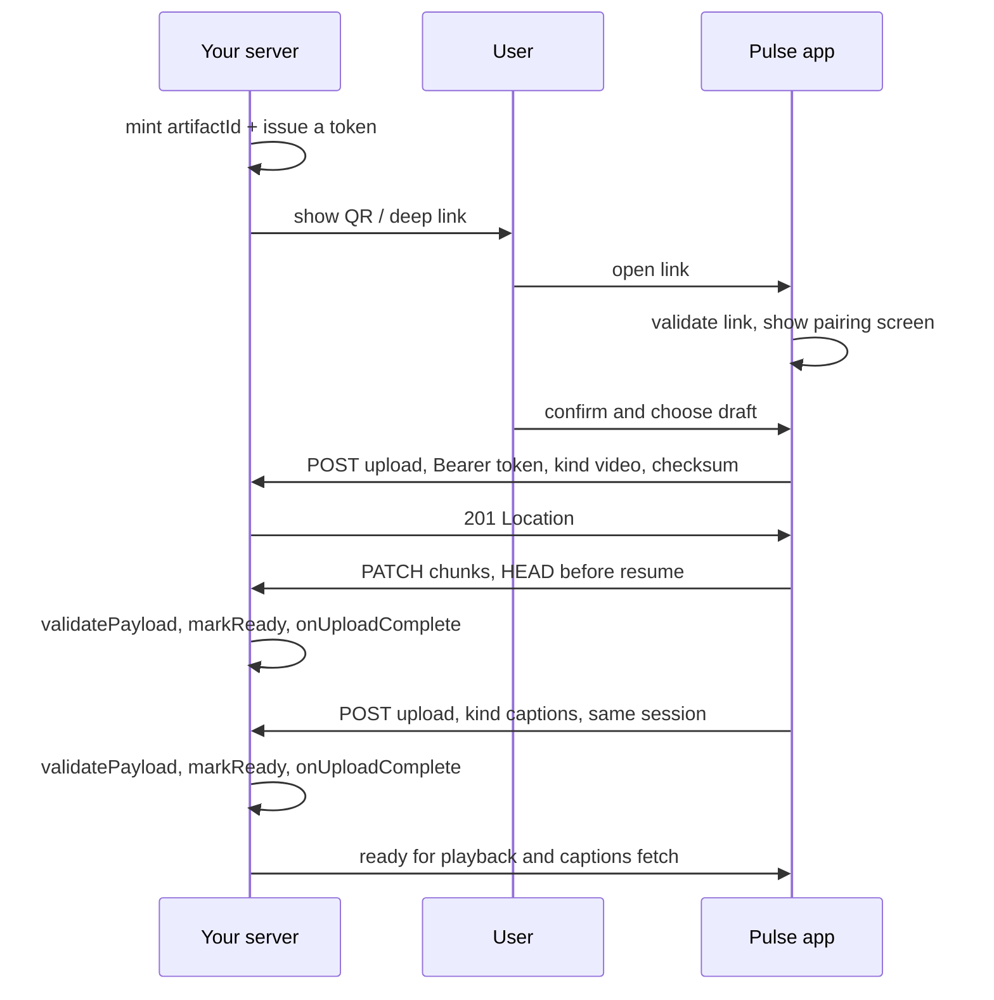

# @mieweb/pulsevault

Fastify plugin for resumable video uploads via the [TUS protocol](https://tus.io/), with filesystem-first local storage and deep link helpers for the [Pulse](https://github.com/mieweb/pulse) mobile app.

**Licensing note**: this package is currently Source Available (free for non-commercial use; see [License](#license)) — a move to a fully OSI-approved open source license is planned but not yet landed. If you're evaluating this for adoption, read [License](#license) before investing evaluation time.

See also: [`PROTOCOL.md`](PROTOCOL.md) (the wire contract, independent of this implementation — read this if you're building a Pulse-compatible server *without* this package) and [`OPERATIONS.md`](OPERATIONS.md) (scaling, secrets, retention, monitoring).

Self-hosted video capture for places that can't ship recordings to a vendor. Pulse records the walkthrough on the phone; Pulsevault receives it inside the Fastify app you already run, behind your auth, on your storage. Pair a device by QR code and upload over TUS so two-minute captures from the floor survive signal drops and device restarts.

Hook in at `authorize`, `validatePayload`, or `onUploadComplete` to bolt on whatever your institution already runs — SSO, audit logs, transcoding queues, AI pipelines. The plugin mounts a handful of routes; the rest stays yours. **Every deployment of this plugin is fully independent** — there's no central Pulse-run service anywhere in this picture:


```mermaid
graph LR
    subgraph "Org A — fully independent"
        A1["Org A's Fastify server"] -->|registers| A2["@mieweb/pulsevault"]
        A1 -->|owns| A3["artifactId minting, token issuance,\nTTL policy, secret rotation, revocation"]
    end
    subgraph "Org B — fully independent, no pulsevault"
        B1["Org B's own server"] -->|implements from spec only| B2["PROTOCOL.md"]
        B1 -->|owns| B3["its own auth scheme entirely"]
    end
    P["Pulse mobile app\nmulti-tenant client"] -->|pairs + uploads via open contract| A1
    P -->|pairs + uploads via open contract| B1
    P -.->|no dependency on either| X[("No central Pulse service")]
```

The local storage adapter writes to a stable on-disk layout (see [Local storage](#local-storage)) so you can layer post-processing — transcription, thumbnails, AI analysis — directly against the files from an `onUploadComplete` hook.

## Requirements

- Fastify `^5.x`
- Node.js `>=18`

## Installation

```sh
npm install @mieweb/pulsevault
```

## Quick start

```ts
import Fastify from "fastify";
import { randomUUID } from "node:crypto";
import pulseVault, { createLocalStorage } from "@mieweb/pulsevault";

const app = Fastify();

await app.register(pulseVault, {
  prefix: "/pulsevault",
  storage: createLocalStorage({ workspaceDir: "./data" }),
  maxUploadSize: 5 * 1024 * 1024 * 1024, // 5 GiB
});

// Your server owns artifactId creation — attach auth, DB records, quotas here.
app.post("/reserve", async (_req, reply) => {
  return reply.send({ artifactId: randomUUID() });
});

await app.listen({ port: 3030 });
```

This is the minimal setup with no authentication — fine for local development,
not for production. See [`authorize`](#authorize) and [Capability tokens](#capability-tokens)
for a secure-by-default option, and `OPERATIONS.md` for the full production checklist.

## How a pairing + upload session flows


```mermaid
sequenceDiagram
    participant Org as Your server
    participant User
    participant Pulse as Pulse app

    Org->>Org: mint artifactId + issue a token
    Org->>User: show QR / deep link
    User->>Pulse: open link
    Pulse->>Pulse: validate link, show pairing screen
    User->>Pulse: confirm and choose draft
    Pulse->>Org: POST upload, Bearer token, kind video, checksum
    Org->>Pulse: 201 Location
    Pulse->>Org: PATCH chunks, HEAD before resume
    Org->>Org: validatePayload, markReady, onUploadComplete
    Pulse->>Org: POST upload, kind captions, same session
    Org->>Org: validatePayload, markReady, onUploadComplete
    Org->>Pulse: ready for playback and captions fetch
```

## Routes

The plugin mounts the following routes under `prefix`:

| Method | Path | Description |
| --- | --- | --- |
| `GET` | `/pulsevault/capabilities` | Unauthenticated discovery: protocol version, `uploadUnit`, allowed extensions, limits |
| `POST` | `/pulsevault/upload` | Create a TUS upload session |
| `PATCH` / `HEAD` / `DELETE` \* | `/pulsevault/upload/:id` | Upload chunks, probe offset, cancel upload (TUS) |
| `GET` | `/pulsevault/artifacts/:artifactId` | Stream or redirect to the uploaded artifact (any kind) |
| `DELETE` | `/pulsevault/artifacts/:artifactId` | Delete a finalized upload (bytes + sidecar) |

\* `DELETE /pulsevault/upload/:id` is TUS's own "cancel in-flight upload" — distinct from `DELETE /pulsevault/artifacts/:artifactId`, which removes a finalized artifact.

> `POST /reserve` is **not** part of the plugin. Your server implements it so you control auth, ownership, and any business logic tied to artifact creation.

`GET /pulsevault/artifacts/:artifactId` only serves uploads whose adapter has been told to mark them ready. With the built-in local adapter, that means the final PATCH has landed _and_ `validatePayload` (if configured) accepted the bytes. In-progress uploads return 404. The artifact's kind (`video`/`project`/`captions`) is resolved from storage, not the URL — there's one route for every kind.

## Plugin options

```ts
type PulseVaultPluginOptions = {
  storage: PulseVaultStorage;
  prefix: string;
  maxUploadSize: number;
  uploadUnit?: "beat" | "merged";              // default: "beat" — see "Upload unit"
  decoratorName?: string;                      // default: "pulseVault"
  allowedExtensions?:
    | string[]                                                          // legacy — treated as video-only
    | { video?: string[]; project?: string[]; captions?: string[] };    // per-kind (recommended)
  // defaults: { video: [".mp4"], project: [".pulse", ".zip"], captions: [".srt"] }
  cache?: PulseVaultCacheOptions;
  authorize?: PulseVaultAuthorize;
  validatePayload?: PulseVaultValidatePayload;          // runs for every kind; branch on ctx.kind
  onUploadComplete?: PulseVaultOnUploadComplete;        // runs for every kind; branch on ctx.kind
  onArtifactEvent?: PulseVaultOnArtifactEvent;          // low-frequency hook for metrics + audit logging
  /** @deprecated use validatePayload + ctx.kind === "project" */
  validateProjectPayload?: PulseVaultValidatePayload;
  /** @deprecated use onUploadComplete + ctx.kind === "project" */
  onProjectUploadComplete?: PulseVaultOnUploadComplete;
};
```

### `storage`

A `PulseVaultStorage` adapter. Use the built-in `createLocalStorage` for filesystem-backed deployments (the blessed default), `createS3Storage` for Cloudflare R2 / AWS S3 (see [Object storage](#object-storage-cloudflare-r2--aws-s3)), or implement the interface for custom backends (GCS, database, etc.).

### `prefix`

URL prefix for all plugin routes. Set to `"/pulsevault"` for the standard namespaced mount. Use `""` to mount at the root. Must start with `/` (no trailing slash) or be `""`.

> Because the plugin uses `fastify-plugin` to escape encapsulation, Fastify's native `register(..., { prefix })` is a no-op — always pass `prefix` through this option.

### `maxUploadSize`

Maximum upload size in bytes. Use `Infinity` for no cap.

### Upload unit

`uploadUnit: "beat" | "merged"` — purely advertised via `GET /pulsevault/capabilities`; **the plugin doesn't enforce either.** It tells the client which upload strategy this deployment expects:

- `"beat"` (default): the client uploads each clip individually (no merge/re-encode pass), plus a `kind=project` manifest artifact for ordering. Lower client-side cost, finer-grained resumability.
- `"merged"`: the client pre-merges a pulse's clips into one video before uploading. Simpler server-side mental model (one artifact per pulse), more client-side work.

A client reads this at pairing time, before doing any merge or upload work, and branches accordingly. See `PROTOCOL.md` §8 for the full contract.

### `decoratorName`

Name of the Fastify decorator that exposes the storage adapter on the instance. Defaults to `"pulseVault"`. Override when registering the plugin more than once in the same process.

For TypeScript access to the default decorator, add a side-effect import once in your app:

```ts
import "@mieweb/pulsevault/augment";
```

### `allowedExtensions`

File extensions accepted per artifact kind. Three accepted forms:

```ts
// 1. Omit entirely — uses all three defaults:
//    video: [".mp4"]   project: [".pulse", ".zip"]   captions: [".srt"]

// 2. Flat array (legacy) — video-only; project/captions keep their defaults:
allowedExtensions: [".mp4"]

// 3. Per-kind object — unset keys fall back to their defaults:
allowedExtensions: { video: [".mp4"], project: [".pulse"], captions: [".srt"] }
```

All extensions must include the leading dot and are matched case-insensitively. The `kind` field in `Upload-Metadata` determines which list is checked.

### `cache`

Cache-control options for the `GET /artifacts/:artifactId` route, forwarded to `@fastify/send`:

```ts
type PulseVaultCacheOptions = {
  cacheControl?: boolean; // default: true
  maxAge?: string | number; // ms or ms-style string e.g. "1y". default: 0
  immutable?: boolean; // requires maxAge > 0. default: false
};
```

Upload filenames are keyed by UUID, so `immutable: true` is safe when `maxAge` is non-zero.

### `authorize`

Optional async hook called before TUS create/patch, before GET resolve, and before DELETE. Throw to reject — a `statusCode` or `status_code` number on the thrown error is used as the HTTP status (default `403`).

```ts
type PulseVaultAuthorize = (
  request: FastifyRequest,
  ctx: {
    phase: "create" | "patch" | "resolve" | "delete";
    artifactId: string;
    kind: "video" | "project" | "captions";  // artifact kind; always present
    token?: string;             // only on "resolve" phase
    relatedTo?: string;         // the session-anchor artifact this one belongs to, if any
  },
) => void | Promise<void>;
```

```ts
await app.register(pulseVault, {
  // ...
  authorize: async (request, { phase, artifactId, kind }) => {
    const token = request.headers.authorization?.replace("Bearer ", "");
    if (!isValid(token, artifactId)) {
      throw Object.assign(new Error("Forbidden"), { statusCode: 403 });
    }
  },
});
```

Don't want to write your own auth from scratch? See [Capability tokens](#capability-tokens) for a secure-by-default option.

### `validatePayload`

Optional async hook that runs _after_ TUS writes the final byte but _before_ the upload is marked ready or `onUploadComplete` fires — **for every artifact kind**, with `ctx.kind` telling you which. Throw to reject — the plugin calls `storage.remove` to free the bytes and returns a 4xx (default 422) to the client. The sidecar never flips to `"ready"`, so the artifact is never served.

```ts
type PulseVaultValidatePayload = (
  request: FastifyRequest,
  ctx: {
    artifactId: string;
    size: number;
    uploadId: string;
    kind: "video" | "project" | "captions";
    /** Absolute path to finalized bytes for adapters that expose `getLocalPath`. */
    localPath: string | null;
    /** Client-supplied `<algorithm>:<hex>` digest, if `Upload-Metadata.checksum` was sent. */
    checksum?: string;
  },
) => void | Promise<void>;
```

Use for magic-byte sniffing, checksum verification, virus scanning, size re-checks — anything that needs the final bytes. Ready-made helpers ship with the package:

```ts
import pulseVault, {
  createLocalStorage,
  createMp4Sniffer,
  createChecksumValidator,
} from "@mieweb/pulsevault";

const storage = createLocalStorage({ workspaceDir: "./data" });

await app.register(pulseVault, {
  // ...
  storage,
  // Chain validators: checksum runs first, then the MP4 sniff.
  validatePayload: createChecksumValidator(createMp4Sniffer(storage)),
});
```

`createMp4Sniffer` reads the first 12 bytes and verifies the ISOBMFF `ftyp` header (MP4, MOV, M4V, 3GP). Uploads that pass the extension check but contain non-video bytes are rejected with 422 and the disk is cleaned up. The lower-level `sniffMp4(path)` is also exported if you want to drive your own validator.

`createChecksumValidator`/`createS3ChecksumValidator` parse `ctx.checksum` with the also-exported `parseChecksumMetadata(raw)`, which returns `{ algorithm, digest }` or `null` for a missing/malformed value — use it directly if you're writing your own checksum check instead of the ship-ready validators.

`createMp4Sniffer`/`createChecksumValidator` only make sense for `kind=video`/general payloads — they run unconditionally for every kind your hook receives, so branch on `ctx.kind` yourself if you only want them applied to one kind, or compose differently per kind:

```ts
validatePayload: async (request, ctx) => {
  if (ctx.kind === "video") return createMp4Sniffer(storage)(request, ctx);
  // project/captions: no byte-level check, or your own.
},
```

### `onUploadComplete`

Optional async hook fired once the final byte is written, `validatePayload` has passed, and the sidecar has been marked ready — **for every artifact kind**, with `ctx.kind` telling you which. Use it to update a database row, enqueue a job, or write an audit log. Throwing returns a `500` to the client. The artifact is ready at this point — if you want all-or-nothing semantics, call `storage.remove` before throwing.

```ts
type PulseVaultOnUploadComplete = (
  request: FastifyRequest,
  ctx: { artifactId: string; kind: "video" | "project" | "captions"; size: number; uploadId: string },
) => void | Promise<void>;
```

### `onArtifactEvent`

Optional low-frequency hook — fired on authorize rejection (`create`/`delete`/`resolve` phases only, never per-chunk `patch`), upload completion, and payload-validation rejection. One hook covers both ops metrics and a compliance audit trail instead of hand-wiring both from the lower-level hooks above:

```ts
type PulseVaultArtifactEvent = {
  phase: "authorize" | "complete" | "reject";
  artifactId: string;
  kind: "video" | "project" | "captions";
  size?: number;
  reason?: string; // present for "authorize" and "reject"
};

onArtifactEvent: (event) => {
  app.log.info(event, "pulsevault artifact event"); // or push to a metrics/audit sink
},
```

See `OPERATIONS.md` for a Prometheus-counter example and what to alert on.

### `validateProjectPayload` / `onProjectUploadComplete` (deprecated)

Same lifecycle as `validatePayload`/`onUploadComplete`, but only fired for `kind=project` uploads. **Deprecated** — use the generic `validatePayload`/`onUploadComplete` with a `ctx.kind === "project"` branch instead. Still honored this release (passing either emits a one-time `DeprecationWarning` at registration); will be removed in a future major version.

### Upload-complete sequencing

When the final PATCH lands the plugin runs the following steps in order, for every kind. Any step failing short-circuits the rest.

1. **`validatePayload`** (optional, runs for every kind) — throws → `storage.remove(artifactId)`, HTTP 4xx (default 422).
2. **`storage.markReady(artifactId)`** — flips the sidecar so `resolve()` will serve the bytes.
3. **`onUploadComplete`** (optional, runs for every kind) — throws → HTTP 500; bytes remain ready unless the consumer removes them.

(`validateProjectPayload`/`onProjectUploadComplete`, if passed, run instead of the generic hooks specifically for `kind=project` — see the deprecation note above.)

## Capabilities discovery

`GET {prefix}/capabilities` is unauthenticated (no secrets in the response) and lets a client detect protocol compatibility and this deployment's configuration before pairing:

```json
{
  "protocolVersion": 1,
  "minSupportedVersion": 1,
  "maxSupportedVersion": 1,
  "uploadUnit": "beat",
  "kinds": ["video", "project", "captions"],
  "allowedExtensions": { "video": [".mp4"], "project": [".pulse", ".zip"], "captions": [".srt"] },
  "maxUploadSize": 5368709120,
  "checksum": { "algorithms": ["sha256", "sha1", "md5"] }
}
```

`checksum.algorithms` always lists what `createChecksumValidator`/`createS3ChecksumValidator` are capable of verifying — it does not detect whether this deployment's `validatePayload` actually calls one of them. A client sending a `checksum` metadata value is only verified if the operator wired in one of these helpers (or an equivalent check of their own).

See `PROTOCOL.md` §2 for the full normative shape.

## Capability tokens

Don't want to write your own auth scheme? `issueCapabilityToken`/`verifyCapabilityToken`/`createCapabilityAuthorize` implement a stateless, HMAC-signed token — no server-side session table, so you can rotate secrets, change TTL policy, or revoke at the artifact level entirely on your own schedule.

```ts
import pulseVault, {
  createLocalStorage,
  createCapabilityAuthorize,
  issueCapabilityToken,
  buildUploadLink,
} from "@mieweb/pulsevault";
import { randomUUID } from "node:crypto";

const keys = { "2026-06": process.env.PULSEVAULT_KEY_2026_06! }; // add the previous key during rotation
const issuer = "https://vault.example.org"; // identity claim — no path, just who issued the token
const prefix = "/pulsevault";

await app.register(pulseVault, {
  prefix,
  storage: createLocalStorage({ workspaceDir: "./data" }),
  maxUploadSize: 5 * 1024 * 1024 * 1024,
  authorize: createCapabilityAuthorize((kid) => keys[kid] ?? null, { issuer }),
});

app.post("/pair", async (_req, reply) => {
  const artifactId = randomUUID();
  const token = issueCapabilityToken(artifactId, keys["2026-06"], {
    keyId: "2026-06",
    issuer,
    expirySeconds: 1800, // 30 minutes — long enough for one upload session
  });
  // `server` is the full base URL the client uploads to — origin *plus* the
  // plugin's prefix — not just `issuer`'s bare origin.
  return reply.send({ link: buildUploadLink({ server: `${issuer}${prefix}`, artifactId, token }) });
});
```

A token authorizes either the artifact it names, or any artifact that declares that one as its `relatedTo` — so one token issued for a video also covers its captions and (under `uploadUnit: "beat"`) every beat and the manifest in the same session, without minting a token per artifact. See `PROTOCOL.md` §5.4 for the full claim shape (`kid`/`iat`/`exp`/`issuer`/`artifactId`) and rationale.

## Upload-Metadata protocol

The TUS `Upload-Metadata` header is a comma-separated list of `<key> <base64>` pairs. PulseVault reads the following keys on `POST /upload`:

| Key | Required | Description |
|---|---|---|
| `artifactId` | Yes (or `videoid`/`projectid`) | Server-generated UUID for this upload. |
| `videoid` / `projectid` | Legacy aliases for `artifactId` | Accepted as synonyms indefinitely (protocol v1). Use `artifactId` for new code. |
| `filename` | Yes | Original filename. The extension is validated against the kind's allowed list. |
| `kind` | No | `video` (default), `project`, or `captions`. Determines the storage subdir and which hooks fire. |
| `relatedTo` | No | UUID of another artifact this one belongs to (e.g. a video's captions). Lets one capability token authorize a whole session. |
| `checksum` | No | `<algorithm>:<hex digest>` of the finished file, verified by `createChecksumValidator`/`createS3ChecksumValidator` if configured. |

Example (`kind=captions`, linked to a video):

```
Upload-Metadata: artifactId <base64(uuid)>, filename <base64("clip.srt")>, kind <base64("captions")>, relatedTo <base64(videoArtifactId)>
```

## Local storage

```ts
import { createLocalStorage } from "@mieweb/pulsevault";

const storage = createLocalStorage({
  workspaceDir: "./data",   // directory for uploads; created if absent
  metaCacheLimit: 10_000,   // optional — bounds the in-memory metadata cache
});
```

### Filesystem layout (stable contract)

The local adapter writes uploads into flat kind-scoped subdirectories. Downstream tools may rely on this layout across minor versions:

```text
<workspaceRoot>/
  .pulsevault/<id>.json           # sidecar: { version, ext, filename, status, kind, relatedTo, checksum }
  video/<id><ext>                 # video upload bytes    (kind="video")
  video/<id><ext>.json            # @tus/file-store offset/metadata sidecar
  project/<id><ext>               # project bundle bytes  (kind="project")
  project/<id><ext>.json          # @tus/file-store offset/metadata sidecar
  captions/<id><ext>              # captions bytes        (kind="captions")
  captions/<id><ext>.json         # @tus/file-store offset/metadata sidecar
```

`status` is `"uploading"` between `reserveUpload` and the successful final PATCH; `"ready"` thereafter. `GET /artifacts/:id` only serves `"ready"` uploads. `kind` defaults to `"video"` when absent (back-compat with pre-kind sidecars).

The adapter exposes `storage.workspaceRoot` (absolute, resolved from `workspaceDir`) so consumers can compute per-resource paths without re-implementing the layout. `storage.getKind(id)` returns `"video" | "project" | "captions" | null`; `storage.getRelatedTo(id)` and `storage.getChecksum(id)` return the corresponding sidecar fields, each `null` if absent/unknown.

**Horizontal scaling**: this adapter requires sticky-session routing or a shared filesystem across instances — see `OPERATIONS.md`.

### Post-processing (transcription, thumbnails, AI)

The filesystem layout is the integration surface. Use the `onUploadComplete` hook as your trigger. For example, to hydrate an [ArtiPod](https://github.com/mieweb/artipod) with the video plus sibling artifact directories:

```ts
import path from "node:path";
import { ArtiPod, ArtiMount } from "@mieweb/artipod";
import pulseVault, { createLocalStorage } from "@mieweb/pulsevault";

const storage = createLocalStorage({ workspaceDir: "./data" });

await app.register(pulseVault, {
  prefix: "/pulsevault",
  storage,
  maxUploadSize: 5 * 1024 * 1024 * 1024,
  onUploadComplete: async (_req, { artifactId, kind }) => {
    if (kind !== "video") return;
    const videoDir = path.join(storage.workspaceRoot, "video");
    const pod = new ArtiPod({ id: artifactId, useMainMount: false });
    pod.addMount(new ArtiMount("video", videoDir));
    // Create these lazily as your pipeline produces artifacts:
    // pod.addMount(new ArtiMount("transcripts", path.join(root, "transcripts")));
    // pod.addMount(new ArtiMount("frames", path.join(root, "frames")));
    await pod.initialize();
    // Run a containerized transcription step, build an LLM prompt from
    // collected artifacts, etc. See the @mieweb/artipod docs for details.
  },
});
```

`@mieweb/artipod` is **not** a dependency of this plugin — install it in your app only if you want it. Any filesystem-native pipeline (ffmpeg, whisper, rsync) works equally well.

## Object storage (Cloudflare R2 / AWS S3)

`createS3Storage` is a built-in adapter that streams uploads into an S3-compatible bucket via S3 multipart upload and serves playback by redirecting the client to a short-lived **presigned URL** (so bytes never flow back through your server). Because Cloudflare R2 speaks the S3 API, the same adapter covers both R2 and AWS S3 — they differ only by endpoint and credentials. It has no horizontal-scaling caveat — every instance talks to the same bucket.

It's **opt-in**: the AWS SDK and `@tus/s3-store` are `optionalDependencies`, loaded lazily only when you call `createS3Storage`. Install them in your app:

```bash
npm install @aws-sdk/client-s3 @aws-sdk/s3-request-presigner @tus/s3-store
```

`createS3Storage` is **async** (it lazily imports those packages), so `await` it before registering the plugin.

**Cloudflare R2:**

```ts
import pulseVault, { createS3Storage, createS3Mp4Sniffer } from "@mieweb/pulsevault";

const storage = await createS3Storage({
  bucket: "pulse-videos",
  endpoint: `https://${process.env.R2_ACCOUNT_ID}.r2.cloudflarestorage.com`,
  accessKeyId: process.env.R2_ACCESS_KEY,
  secretAccessKey: process.env.R2_SECRET_KEY,
});

await app.register(pulseVault, {
  prefix: "/pulsevault",
  storage,
  maxUploadSize: 5 * 1024 * 1024 * 1024,
  validatePayload: createS3Mp4Sniffer(storage), // ranged-read MP4 sniff
});
```

**AWS S3** — drop the custom `endpoint` and set `region`:

```ts
const storage = await createS3Storage({
  bucket: "pulse-videos",
  region: "us-east-1",
  accessKeyId: process.env.AWS_ACCESS_KEY_ID,
  secretAccessKey: process.env.AWS_SECRET_ACCESS_KEY,
});
```

Credentials are optional — omit `accessKeyId`/`secretAccessKey` to use the AWS SDK's default credential chain (env vars, IAM role, etc.). **Never hard-code keys; read them from the environment** — see `OPERATIONS.md` for a secrets-manager example.

### Object layout

```text
<bucket>/
  .pulsevault/<id>.json   # metadata sidecar: { version, ext, filename, status, kind, relatedTo, checksum }
  video/<id><ext>         # finalized video object    (kind="video")
  project/<id><ext>       # finalized project object  (kind="project")
  captions/<id><ext>      # finalized captions object (kind="captions")
  <key>.info              # @tus/s3-store multipart bookkeeping (transient)
```

`resolve()` only returns a presigned URL once the sidecar `status` is `"ready"` (after the final byte lands and `validatePayload` passes), so in-progress or rejected uploads are never served. `getKind(id)` returns the kind without a full resolve; `getRelatedTo(id)`/`getChecksum(id)` mirror the local adapter.

### Options

| Option | Default | Notes |
| --- | --- | --- |
| `bucket` | — | Required. Must already exist. |
| `endpoint` | — | Custom S3 endpoint (set for R2). Omit for AWS S3. |
| `region` | `"auto"` when `endpoint` is set | Required for AWS S3. |
| `accessKeyId` / `secretAccessKey` | SDK default chain | Optional; omit both to use env/IAM credentials. |
| `sessionToken` | — | Optional STS session token for temporary credentials. |
| `forcePathStyle` | `true` when `endpoint` is set | R2 and most S3-compatible stores need path-style. |
| `presignTtlSeconds` | `900` | Lifetime of the playback presigned URL. |
| `partSize` | computed | Preferred multipart part size (≥ 5 MiB), forwarded to `@tus/s3-store`. |
| `metaCacheLimit` | `10000` | Caps the in-memory metadata cache before evicting the oldest entry. |
| `clientConfig` | — | Advanced: extra `S3ClientConfig` merged into the client. |

> The runnable demo wires these to environment variables — see [`examples/rn-demo/.env.example`](examples/rn-demo/.env.example) for the full list (`STORAGE`, `S3_BUCKET`, `S3_ENDPOINT`, `AWS_REGION`, `S3_ACCESS_KEY_ID`, `S3_SECRET_ACCESS_KEY`, …).

### Payload validation on remote storage

The default `createMp4Sniffer`/`createChecksumValidator` read a local file path, which doesn't exist for a bucket object. Use **`createS3Mp4Sniffer(storage)`**/**`createS3ChecksumValidator(storage)`** instead: they fetch the bytes they need via the adapter (a small ranged GET for the MP4 sniff; a full object read for the checksum, since a digest needs every byte) rather than assuming a local path.

### Direct playback & CORS

Because playback is a 302 redirect to a presigned URL, a browser fetching it goes **directly** to R2/S3. If you play back from a web origin, add a bucket CORS rule allowing your origin (`GET`, and `Range` for seeking). Native clients that follow redirects need no CORS.

## Custom storage adapter

Implement `PulseVaultStorage` to back uploads with any system (S3, GCS, database, etc.):

```ts
import type {
  PulseVaultStorage,
  PulseVaultResolution,
} from "@mieweb/pulsevault";

const storage: PulseVaultStorage = {
  datastore, // @tus/server DataStore instance
  async initialize() {
    /* optional setup */
  },
  async shutdown() {
    /* optional teardown */
  },
  async reserveUpload({ artifactId, filename, ext, kind, relatedTo, checksum }) {
    // Called by the TUS naming function. Return the file id for the datastore.
    await db.createArtifact({ artifactId, filename, kind, relatedTo, checksum, status: "uploading" });
    return `${kind}/${artifactId}${ext}`;
  },
  async resolve(artifactId): Promise<PulseVaultResolution | null> {
    const artifact = await db.findArtifact(artifactId);
    if (!artifact || artifact.status !== "ready") return null;
    // Stream from local disk:
    return { kind: "stream", root: "/uploads", filename: artifact.filename };
    // Or redirect to a CDN / presigned URL:
    // return { kind: "redirect", url: artifact.signedUrl, statusCode: 302 };
  },
  async markReady(artifactId) {
    // Called after `validatePayload` (if any) accepts the bytes. Flip your
    // state so `resolve` starts returning non-null. Omit this method if
    // your backend can't distinguish in-progress from finalized uploads.
    await db.updateArtifact(artifactId, { status: "ready" });
  },
  async remove(artifactId) {
    // Called from DELETE /artifacts/:artifactId and from the plugin's
    // cleanup path when `validatePayload` rejects an upload. Return false if
    // the artifactId was already absent.
    const result = await db.deleteArtifact(artifactId);
    return result.deleted;
  },
  // Optional — only needed if you use relatedTo/checksum-aware hooks/validators:
  async getKind(artifactId) { return (await db.findArtifact(artifactId))?.kind ?? null; },
  async getRelatedTo(artifactId) { return (await db.findArtifact(artifactId))?.relatedTo ?? null; },
  async getChecksum(artifactId) { return (await db.findArtifact(artifactId))?.checksum ?? null; },
};
```

## Deep link helper

Use this to generate a `pulsecam://` deep link for pairing the Pulse mobile app with your server. Typically encoded as a QR code on a pairing page.

```ts
import { buildUploadLink } from "@mieweb/pulsevault";
import { randomUUID } from "node:crypto";

// Opens the app directly on the upload screen for a specific artifact.
// `server` must include your `prefix` — e.g. "https://example.com/pulsevault",
// not just the bare origin — the client has no separate notion of a prefix.
const uploadLink = buildUploadLink({
  server: "https://example.com/pulsevault",
  artifactId: randomUUID(), // generate server-side; skip POST /reserve on the app
  token: "secret", // optional — forwarded to your authorize hook; see Capability tokens
});
// pulsecam://?v=1&artifactId=...&server=https%3A%2F%2Fexample.com%2Fpulsevault&token=secret
```

## Tests

```sh
npm test
```

Runs a Node `--test` suite against the built plugin. Coverage includes:

- TUS create/HEAD/PATCH resume, collision handling, extension rejection, range GETs
- Ready-gate (`GET` returns 404 while uploading)
- The generic `GET/DELETE /artifacts/:artifactId` route, and that the old per-kind routes are gone (not kept as a parallel API)
- `authorize` rejection on every phase; `kind`/`relatedTo` in the authorize context
- `validatePayload`/`onUploadComplete` running for every kind via `ctx.kind`, plus the deprecated `validateProjectPayload`/`onProjectUploadComplete` aliases
- `kind=project` and `kind=captions` happy paths — correct subdir, `Content-Type`, sidecar, `relatedTo` linking
- Extension mismatch rejections in both directions
- `artifactId`/`videoid`/`projectid` metadata aliases
- `getKind()`/`getRelatedTo()`/`getChecksum()` storage methods
- Legacy sidecars (no `kind` field) default to `"video"`, readable through the new generic route with no data migration
- Sidecar corruption recovery
- `allowedExtensions` object form
- `createChecksumValidator`/`createS3ChecksumValidator`: matching digest accepted, mismatch rejected with cleanup
- `issueCapabilityToken`/`verifyCapabilityToken`/`createCapabilityAuthorize`: round-trip, tampered signature/payload, expiry + clock tolerance, unknown `kid`, issuer mismatch, key-rotation overlap, `relatedTo`-based session authorization — both as fast unit tests (no server) and wired into real HTTP requests
- `GET /capabilities`
- S3/R2 backend (`createS3Storage`): full resumable upload → presigned-redirect playback, `createS3Mp4Sniffer`, `createS3ChecksumValidator`, `DELETE`, `kind=project`/`captions`, run against an in-process [s3rver](https://github.com/jamhall/s3rver) mock (no cloud credentials needed)

## Accessing storage outside the plugin routes

The storage adapter is exposed as a Fastify decorator, so you can use it in your own routes:

```ts
import "@mieweb/pulsevault/augment"; // once, for TypeScript types

app.get("/admin/artifact/:id", async (req, reply) => {
  const resolved = await app.pulseVault.resolve(req.params.id);
  if (!resolved) return reply.code(404).send();
  // custom logic...
});
```

## License

Source Available — free for non-commercial use under the terms in [LICENSE](LICENSE), which also requires that redistributions be published under an OSI-approved open source license. Commercial use requires a separate license from Medical Informatics Engineering, LLC — contact [helpdesk@mieweb.com](mailto:helpdesk@mieweb.com) or [mieweb.com](https://www.mieweb.com).

A move to a fully OSI-approved open source license for this package itself is planned, to remove this friction for adopters entirely — tracked as a follow-up, not yet decided which license.

Copyright © 2026 Medical Informatics Engineering, LLC. All rights reserved.
