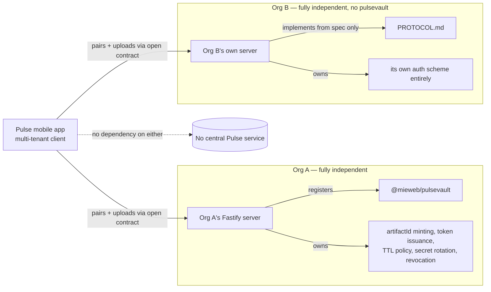
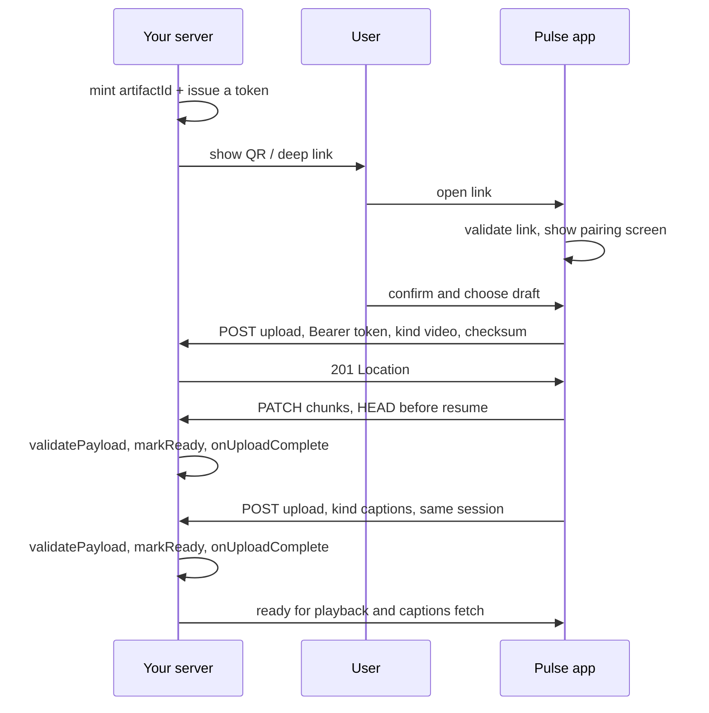

# @mieweb/pulsevault

Resumable video uploads via the [TUS protocol](https://tus.io/), with filesystem-first local storage and deep link helpers for the [Pulse](https://github.com/mieweb/pulse) mobile app. Ships as a Fastify plugin (`@mieweb/pulsevault`) and as a framework-agnostic core (`@mieweb/pulsevault/core`) for Express, Meteor, or plain `http.createServer` — see [Non-Fastify hosts](#non-fastify-hosts-express-meteor-plain-http).

See also: [`PROTOCOL.md`](PROTOCOL.md) (the wire contract, independent of this implementation — read this if you're building a Pulse-compatible server *without* this package) and [`OPERATIONS.md`](OPERATIONS.md) (scaling, secrets, retention, monitoring).

Self-hosted video capture for places that can't ship recordings to a vendor. Pulse records the walkthrough on the phone; Pulsevault receives it inside the backend you already run, behind your auth, on your storage. Pair a device by QR code and upload over TUS so two-minute captures from the floor survive signal drops and device restarts.

Hook in at `authorize`, `validatePayload`, or `onUploadComplete` to bolt on whatever your institution already runs — SSO, audit logs, transcoding queues, AI pipelines. The plugin mounts a handful of routes; the rest stays yours. **Every deployment of this plugin is fully independent** — there's no central Pulse-run service anywhere in this picture:


```mermaid
graph LR
    subgraph "Org A — fully independent"
        A1["Org A's Fastify server"] -->|registers| A2["@mieweb/pulsevault"]
        A1 -->|owns| A3["artifactId minting, token issuance,\nTTL policy, secret rotation, revocation"]
    end
    subgraph "Org B — fully independent, no pulsevault"
        B1["Org B's own server"] -->|implements from spec only| B2["PROTOCOL.md"]
        B1 -->|owns| B3["its own auth scheme entirely"]
    end
    P["Pulse mobile app\nmulti-tenant client"] -->|pairs + uploads via open contract| A1
    P -->|pairs + uploads via open contract| B1
    P -.->|no dependency on either| X[("No central Pulse service")]
```

The local storage adapter writes to a stable on-disk layout (see [Local storage](#local-storage)) so you can layer post-processing — transcription, thumbnails, AI analysis — directly against the files from an `onUploadComplete` hook.

## Requirements

- Node.js `>=22`
- Fastify `^5.x` — only if you use the default `@mieweb/pulsevault` (Fastify
  plugin) entry point. The framework-agnostic `@mieweb/pulsevault/core` entry
  point (Express, Meteor, or plain `http.createServer`) has no Fastify
  dependency at all — see [Non-Fastify hosts](#non-fastify-hosts-express-meteor-plain-http).

## Installation

```sh
npm install @mieweb/pulsevault
```

## Quick start

```ts
import Fastify from "fastify";
import { randomUUID } from "node:crypto";
import pulseVault, { createLocalStorage } from "@mieweb/pulsevault";

const app = Fastify();

await app.register(pulseVault, {
  prefix: "/pulsevault",
  storage: createLocalStorage({ workspaceDir: "./data" }),
  maxUploadSize: 5 * 1024 * 1024 * 1024, // 5 GiB
});

// Your server owns artifactId creation — attach auth, DB records, quotas here.
app.post("/reserve", async (_req, reply) => {
  return reply.send({ artifactId: randomUUID() });
});

await app.listen({ port: 3030 });
```

This is the minimal setup with no authentication — fine for local development,
not for production. See [`authorize`](#authorize) and [Capability tokens](#capability-tokens)
for a secure-by-default option, and `OPERATIONS.md` for the full production checklist.

## Non-Fastify hosts (Express, Meteor, plain `http`)

Everything above the Fastify-specific route/hook wiring — the authorize/
validatePayload/onUploadComplete orchestration, the TUS glue, the
capabilities payload, artifact GET/DELETE — lives in a framework-agnostic
core that the Fastify plugin itself is a thin adapter over. That core is
published as a separate entry point, `@mieweb/pulsevault/core`, with no
Fastify dependency, so a non-Fastify backend gets full protocol parity for
about the same amount of code as the Fastify quick-start above.

`createPulseVaultCore(...)` returns a connect-style `handler(req, res, next?)`
you can mount directly:

```ts
// Express
import express from "express";
import { randomUUID } from "node:crypto";
import { createPulseVaultCore, createLocalStorage } from "@mieweb/pulsevault/core";

const app = express();
const pulseVault = createPulseVaultCore({
  basePath: "/pulsevault",
  // Express's app.use(prefix, ...) already strips the mount prefix from
  // req.url before calling the middleware, so tell the core not to also
  // match/strip it — basePath is still used for the tus Location header.
  stripBasePath: false,
  storage: createLocalStorage({ workspaceDir: "./data" }),
  maxUploadSize: 5 * 1024 * 1024 * 1024, // 5 GiB
});
app.use("/pulsevault", (req, res, next) => pulseVault.handler(req, res, next).catch(next));

app.post("/reserve", express.json(), (_req, res) => {
  res.json({ artifactId: randomUUID() });
});

app.listen(3030);
```

```ts
// Meteor (server-only module)
import { WebApp } from "meteor/webapp";
import { createPulseVaultCore, createLocalStorage } from "@mieweb/pulsevault/core";

const pulseVault = createPulseVaultCore({
  basePath: "/pulsevault",
  stripBasePath: false, // WebApp.connectHandlers strips the mount prefix too
  storage: createLocalStorage({ workspaceDir: process.env.PULSEVAULT_DIR }),
  maxUploadSize: 5 * 1024 * 1024 * 1024,
});
WebApp.connectHandlers.use("/pulsevault", (req, res, next) => {
  pulseVault.handler(req, res, next).catch(next);
});
```

**Meteor compatibility note.** `WebApp.connectHandlers.use(prefix, handler)`
is the right integration point (it's `connect`, the same shape as Express),
but Meteor's bundler (tested: Meteor 3.4, `modules@0.20.3`) doesn't resolve
`package.json` `"exports"` subpath maps — neither this package's own
`"./core"` entry, nor (transitively, until this release) `@tus/server`'s
own dependency on `srvx`, which shipped *only* subpath exports with no
legacy `main` fallback. Both are worked around: this package pins
`@tus/server`/`@tus/file-store` to `2.0.0` (the last release before the
`srvx` migration — see `CHANGELOG.md`) and ships plain root-level
`core.js`/`augment.js` fallback files alongside the `"exports"` map, so
resolvers that ignore `"exports"` (Meteor's included) still find them via
ordinary relative-path resolution. Verified against a real
`meteor create` app: `WebApp.connectHandlers.use("/pulsevault", ...)`
resolves cleanly and a full TUS create → PATCH → GET round-trip works.

For a bare `http.createServer` (or any host that hands `handler` the
request's full, unmodified URL instead of pre-stripping a mount prefix),
leave `stripBasePath` at its default (`true`):

```ts
import http from "node:http";
import { createPulseVaultCore, createLocalStorage } from "@mieweb/pulsevault/core";

const pulseVault = createPulseVaultCore({
  basePath: "/pulsevault",
  storage: createLocalStorage({ workspaceDir: "./data" }),
  maxUploadSize: 5 * 1024 * 1024 * 1024,
});
http.createServer((req, res) => {
  pulseVault.handler(req, res).catch((err) => {
    res.writeHead(500);
    res.end(String(err));
  });
}).listen(3030);
```

`@mieweb/pulsevault/core` re-exports everything the Fastify entry point does
(`createLocalStorage`, `createS3Storage`, `createMp4Sniffer`,
`createChecksumValidator`, `createCapabilityAuthorize`, etc.), so a
non-Fastify integration only ever imports from this one path — every option
documented under [Plugin options](#plugin-options) below (`authorize`,
`validatePayload`, `onUploadComplete`, `allowedExtensions`, `cache`, and so
on) applies identically. `createPulseVaultCore` differs from the Fastify
plugin's options in a few small ways: it takes `basePath` where the plugin
takes `prefix`; it has no `decoratorName` (there's no Fastify decorator to
name — keep your own reference to `storage` instead); it adds `stripBasePath`
(see above — `false` for hosts that already strip their own mount prefix,
default `true` otherwise); and it adds an optional `logger` (`{ info(obj,
msg?), error(obj, msg?) }`, Pino-shaped) for the core's own internal
diagnostics — the Fastify plugin always uses `request.log` for these
automatically, but a non-Fastify host has no equivalent to infer one from,
so it falls back to `console` when omitted.

Four runnable example servers live under [`examples/`](examples):

- [`examples/fastify-demo`](examples/fastify-demo) — the smallest runnable
  server: Fastify plugin mount, QR pairing, flat upload listing, no auth,
  local storage. Start here.
- [`examples/fastify-auth-demo`](examples/fastify-auth-demo) —
  production-shaped Fastify reference, run through Docker Compose (server +
  Postgres, one `docker compose up --build`): capability tokens always on
  (fails fast at boot without `PULSEVAULT_SECRET`), a [Better
  Auth](https://better-auth.com)-protected React dashboard (email+password),
  a Prisma schema holding both the auth tables and an artifact index
  (`onUploadComplete` writes each finished upload once; `/pulses` is one
  query instead of a sidecar crawl), uploads grouped by recording session
  via `relatedTo`, WebVTT captions, Swagger UI, and an `onArtifactEvent`
  live feed.
- [`examples/meteor-demo`](examples/meteor-demo) — the **reference host
  integration**, on `@mieweb/pulsevault/core` under Meteor: shaped like a
  team app (people, destinations), it reserves an upload by signing the owner
  and destination into the capability token, delivers the video from
  `onUploadComplete` to where it was started, polls the status route from
  the pairing popup, and shows every video as a card with its poster — with
  no table of uploads, no shape check, no stale-upload cleanup and no
  content-type fix-up of its own. Verified against a real `meteor create`
  app, since Meteor's bundler needed the compatibility fixes described above.
- [`examples/express-demo`](examples/express-demo) — the fastify-demo on
  `@mieweb/pulsevault/core` under Express.

## How a pairing + upload session flows


```mermaid
sequenceDiagram
    participant Org as Your server
    participant User
    participant Pulse as Pulse app

    Org->>Org: mint artifactId + issue a token
    Org->>User: show QR / deep link
    User->>Pulse: open link
    Pulse->>Pulse: validate link, show pairing screen
    User->>Pulse: confirm and choose draft
    Pulse->>Org: POST upload, Bearer token, kind video, checksum
    Org->>Pulse: 201 Location
    Pulse->>Org: PATCH chunks, HEAD before resume
    Org->>Org: validatePayload, markReady, onUploadComplete
    Pulse->>Org: POST upload, kind captions, same session
    Org->>Org: validatePayload, markReady, onUploadComplete
    Org->>Pulse: ready for playback and captions fetch
```

A pulse uploads as **one video** — the artifact named by the pairing link — plus related artifacts that declare `relatedTo` it, all under the same session token: WebVTT captions (`kind=captions`, optional), a beat manifest (`kind=project`, `<draftId>-beats.pulse`) and a poster frame (`kind=thumbnail`). A **beat** is a timestamp range inside that video — where each recorded clip starts and ends (`{ segmentId, order, startMs, endMs }`), contiguous and summing to the video's `durationMs`. The beat manifest is groundwork for HLS / deep links into a pulse; it doesn't change how anything is uploaded. See `PROTOCOL.md` §8.

## Routes

The plugin mounts the following routes under `prefix` (`@mieweb/pulsevault/core` mounts the identical set under `basePath` — see [Non-Fastify hosts](#non-fastify-hosts-express-meteor-plain-http)):

| Method | Path | Description |
| --- | --- | --- |
| `GET` | `/pulsevault/capabilities` | Unauthenticated discovery: protocol version, artifact kinds, allowed extensions, limits |
| `POST` | `/pulsevault/upload` | Create a TUS upload session |
| `PATCH` / `HEAD` / `DELETE` \* | `/pulsevault/upload/:id` | Upload chunks, probe offset, delete the upload (TUS) |
| `GET` | `/pulsevault/artifacts/:artifactId` | Stream or redirect to the uploaded artifact (any kind) |
| `POST` | `/pulsevault/artifacts/:artifactId/view-link` | Mint a read-only view link to a finished artifact (only with [`issueViewLink`](#issueviewlink)) |
| `GET` | `/pulsevault/artifacts/:artifactId/status` | Where an upload is: `uploading` (with progress), `processing`, `ready`, plus the host's recorded outcome (see [Status, outcome and pulses](#status-outcome-and-pulses)) |
| `GET` | `/pulsevault/artifacts/:artifactId/poster` | A video's poster frame: the finished thumbnail `relatedTo` it, served like the artifact route |
| `DELETE` | `/pulsevault/artifacts/:artifactId` | Delete a finalized upload (bytes + sidecar); refused once finished with [`lockWhenReady`](#lockwhenready) |

\* `DELETE /pulsevault/upload/:id` is TUS termination, addressed by the upload URL: it removes the artifact whether the upload is still in flight (a cancel) or finished, exactly as `DELETE /pulsevault/artifacts/:artifactId` does by artifactId.

> `POST /reserve` is **not** part of the plugin. Your server implements it so you control auth, ownership, and any business logic tied to artifact creation.

`GET /pulsevault/artifacts/:artifactId` only serves uploads whose adapter has been told to mark them ready. With the built-in local adapter, that means the final PATCH has landed _and_ `validatePayload` (if configured) accepted the bytes. In-progress uploads return 404. The artifact's kind (`video`/`project`/`captions`) is resolved from storage, not the URL — there's one route for every kind.

## Plugin options

```ts
type PulseVaultPluginOptions = {
  storage: PulseVaultStorage;
  prefix: string;
  maxUploadSize: number;
  decoratorName?: string;                      // default: "pulseVault"
  allowedExtensions?:
    | string[]                                                                              // legacy — treated as video-only
    | { video?: string[]; project?: string[]; captions?: string[]; thumbnail?: string[] };  // per-kind (recommended)
  // defaults: { video: [".mp4", ".mov", ".m4v"], project: [".pulse", ".zip"], captions: [".vtt", ".srt"], thumbnail: [".jpg", ".jpeg", ".png"] }
  cache?: PulseVaultCacheOptions;
  authorize?: PulseVaultAuthorize;
  validatePayload?: PulseVaultValidatePayload;          // runs for every kind; branch on ctx.kind
  onUploadComplete?: PulseVaultOnUploadComplete;        // runs for every kind; branch on ctx.kind; at-least-once
  onArtifactEvent?: PulseVaultOnArtifactEvent;          // low-frequency hook for metrics + audit logging
  issueViewLink?: PulseVaultIssueViewLink;              // read-only view links
  retention?: { abandonedAfterSeconds: number; sweepIntervalSeconds?: number };
  pulseShape?: boolean;                                 // default true: creates must have the shape of a pulse
  reclaim?: { idleSeconds?: number } | false;           // default { idleSeconds: 300 }: a create takes over an idle unfinished upload
  lockWhenReady?: boolean;                              // default false: a finished pulse can't be deleted through the routes
  webReady?: PulseVaultWebReadyOptions | boolean;       // default off: background faststart remux / H.264 transcode
  replayCompletions?: { intervalSeconds?: number } | false; // default every 300 s: re-fire unacknowledged completions
  coreDecoratorName?: string;                           // default "pulseVaultCore": getStatus, getPulse, recordOutcome, replayCompletions
  /** @deprecated use validatePayload + ctx.kind === "project" */
  validateProjectPayload?: PulseVaultValidatePayload;
  /** @deprecated use onUploadComplete + ctx.kind === "project" */
  onProjectUploadComplete?: PulseVaultOnUploadComplete;
};
```

### `storage`

A `PulseVaultStorage` adapter. Use the built-in `createLocalStorage` for filesystem-backed deployments (the blessed default), `createS3Storage` for Cloudflare R2 / AWS S3 (see [Object storage](#object-storage-cloudflare-r2--aws-s3)), or implement the interface for custom backends (GCS, database, etc.).

### `prefix`

URL prefix for all plugin routes. Set to `"/pulsevault"` for the standard namespaced mount. Use `""` to mount at the root. Must start with `/` (no trailing slash) or be `""`.

> Because the plugin uses `fastify-plugin` to escape encapsulation, Fastify's native `register(..., { prefix })` is a no-op — always pass `prefix` through this option.

### `maxUploadSize`

Maximum upload size in bytes. Use `Infinity` for no cap.

### `decoratorName`

Name of the Fastify decorator that exposes the storage adapter on the instance. Defaults to `"pulseVault"`. Override when registering the plugin more than once in the same process.

For TypeScript access to the default decorator, add a side-effect import once in your app:

```ts
import "@mieweb/pulsevault/augment";
```

### `allowedExtensions`

File extensions accepted per artifact kind. Three accepted forms:

```ts
// 1. Omit entirely — uses all three defaults:
//    video: [".mp4"]   project: [".pulse", ".zip"]   captions: [".vtt"]

// 2. Flat array (legacy) — video-only; project/captions keep their defaults:
allowedExtensions: [".mp4"]

// 3. Per-kind object — unset keys fall back to their defaults:
allowedExtensions: { video: [".mp4"], project: [".pulse"], captions: [".vtt"] }
```

All extensions must include the leading dot and are matched case-insensitively. The `kind` field in `Upload-Metadata` determines which list is checked.

### `cache`

Cache-control options for the `GET /artifacts/:artifactId` route, forwarded to `@fastify/send`:

```ts
type PulseVaultCacheOptions = {
  cacheControl?: boolean; // default: true
  maxAge?: string | number; // ms or ms-style string e.g. "1y". default: 0
  immutable?: boolean; // requires maxAge > 0. default: false
};
```

Upload filenames are keyed by UUID, so `immutable: true` is safe when `maxAge` is non-zero.

### `authorize`

Optional async hook called before TUS create/patch, before GET resolve, before DELETE, and before minting a view link. Throw to reject — a `statusCode` or `status_code` number on the thrown error is used as the HTTP status (default `403`).

Phase mapping: `"create"` is the initial TUS `POST`; `"patch"` covers `PATCH` chunks and `HEAD` offset queries on the upload routes; `"resolve"` is `GET {prefix}/artifacts/<id>` and the poster route (authorized on the video); `"status"` is `GET {prefix}/artifacts/<id>/status`; `"delete"` is **both** ways of removing an artifact — `DELETE {prefix}/artifacts/<id>` and the TUS `DELETE {prefix}/upload/<id>` (a cancel of an in-flight upload, or removal of a finished one). Gating `phase === "delete"` gates every removal. `"share"` is `POST {prefix}/artifacts/<id>/view-link` — minting a read-only link — and only happens when [`issueViewLink`](#issueviewlink) is set.

```ts
type PulseVaultAuthorize = (
  // PulseVaultRequest only requires `.headers` — under the Fastify plugin
  // this is always the real `FastifyRequest` object (cast if you need
  // Fastify-specific fields); under @mieweb/pulsevault/core it's whatever
  // the host framework hands the handler (Express's `req`, a raw
  // `http.IncomingMessage`, etc.) — the same hook works under either.
  request: PulseVaultRequest,
  ctx: {
    phase: "create" | "patch" | "resolve" | "status" | "delete" | "share";
    artifactId: string;
    kind: "video" | "project" | "captions" | "thumbnail";  // artifact kind; always present
    token?: string;             // only on the "resolve" and "status" phases
    relatedTo?: string;         // the video this artifact belongs to, if it declared one
    name?: string;              // Upload-Metadata.name, when sent
    appVersion?: string;        // Upload-Metadata.appVersion, when sent
    filename?: string;          // Upload-Metadata.filename
    ext?: string;               // its lowercase extension, with the dot
    context?: unknown;          // the token's context, read back from storage (absent on "create")
  },
) => void | { context?: unknown } | Promise<void | { context?: unknown }>;
```

On `create` the hook may return `{ context }`: opaque host data (an owner, a destination) stored with the artifact and handed to every later `authorize`, to `onUploadComplete`, to `getStatus` and to `getPulse`. `createCapabilityAuthorize` returns the token's own `context` claim (see [Capability tokens](#capability-tokens)), so most hosts never touch this.

```ts
await app.register(pulseVault, {
  // ...
  authorize: async (request, { phase, artifactId, kind }) => {
    const token = request.headers.authorization?.replace("Bearer ", "");
    if (!isValid(token, artifactId)) {
      throw Object.assign(new Error("Forbidden"), { statusCode: 403 });
    }
  },
});
```

Don't want to write your own auth from scratch? See [Capability tokens](#capability-tokens) for a secure-by-default option.

### `validatePayload`

Optional async hook that runs _after_ TUS writes the final byte but _before_ the upload is marked ready or `onUploadComplete` fires — **for every artifact kind**, with `ctx.kind` telling you which. Throw to reject — the plugin calls `storage.remove` to free the bytes and returns a 4xx (default 422) to the client. The sidecar never flips to `"ready"`, so the artifact is never served.

```ts
type PulseVaultValidatePayload = (
  request: PulseVaultRequest, // see the note under `authorize` above
  ctx: {
    artifactId: string;
    size: number;
    uploadId: string;
    kind: "video" | "project" | "captions";
    /** Absolute path to finalized bytes for adapters that expose `getLocalPath`. */
    localPath: string | null;
    /** Client-supplied `<algorithm>:<hex>` digest, if `Upload-Metadata.checksum` was sent. */
    checksum?: string;
  },
) => void | Promise<void>;
```

Use for magic-byte sniffing, checksum verification, virus scanning, size re-checks — anything that needs the final bytes. Ready-made helpers ship with the package:

```ts
import pulseVault, {
  createLocalStorage,
  createMp4Sniffer,
  createChecksumValidator,
} from "@mieweb/pulsevault";

const storage = createLocalStorage({ workspaceDir: "./data" });

await app.register(pulseVault, {
  // ...
  storage,
  // Chain validators: checksum runs first, then the MP4 sniff.
  validatePayload: createChecksumValidator(createMp4Sniffer(storage)),
});
```

`createMp4Sniffer` reads the first 12 bytes and verifies the ISOBMFF `ftyp` header (MP4, MOV, M4V, 3GP). Uploads that pass the extension check but contain non-video bytes are rejected with 422 and the disk is cleaned up. The lower-level `sniffMp4(path)` is also exported if you want to drive your own validator.

`createChecksumValidator`/`createS3ChecksumValidator` parse `ctx.checksum` with the also-exported `parseChecksumMetadata(raw)`, which returns `{ algorithm, digest }` or `null` for a missing/malformed value — use it directly if you're writing your own checksum check instead of the ship-ready validators.

`createMp4Sniffer`/`createChecksumValidator` only make sense for `kind=video`/general payloads — they run unconditionally for every kind your hook receives, so branch on `ctx.kind` yourself if you only want them applied to one kind, or compose differently per kind:

```ts
validatePayload: async (request, ctx) => {
  if (ctx.kind === "video") return createMp4Sniffer(storage)(request, ctx);
  // project/captions: no byte-level check, or your own.
},
```

### `onUploadComplete`

Optional async hook fired once the final byte is written, `validatePayload` has passed, and the sidecar has been marked ready — **for every artifact kind**, with `ctx.kind` telling you which. Use it to update a database row, enqueue a job, or write an audit log. Throwing returns a `500` to the client. The artifact is ready at this point — if you want all-or-nothing semantics, call `storage.remove` before throwing.

```ts
type PulseVaultOnUploadComplete = (
  request: PulseVaultRequest, // see the note under `authorize` above; `{ headers: {} }` on a replay
  ctx: {
    artifactId: string;
    kind: "video" | "project" | "captions" | "thumbnail";
    size: number;
    uploadId: string;
    filename: string;        // Upload-Metadata.filename
    ext: string;             // its lowercase extension, with the dot
    relatedTo?: string;      // the video a thumbnail, beat manifest or captions belongs to
    name?: string;           // Upload-Metadata.name (the draft's title), when sent
    appVersion?: string;     // Upload-Metadata.appVersion, when sent
    context?: unknown;       // the capability token's context (see Capability tokens)
    replay: boolean;         // true when PulseVault is firing a completion it never recorded
    webReady?: WebReadyResult; // with `webReady.completeAfter`: what the conversion did
  },
) => void | Promise<void>;
```

**Completion is at-least-once.** PulseVault records that the hook returned (`acknowledged` in the artifact's sidecar). A finished artifact whose hook never returned — it threw, or the process stopped between the final byte and the hook — is fired again later with `ctx.replay: true` (see [`replayCompletions`](#replaycompletions)). So the hook must check its own record before writing it again: an upsert, or a claim that only one caller wins. A retried final `PATCH` for an acknowledged upload does not fire the hook a second time.

### `onArtifactEvent`

Optional low-frequency hook — fired on authorize rejection (every phase but per-chunk `patch`), upload completion, payload-validation rejection, and removal. One hook covers both ops metrics and a compliance audit trail instead of hand-wiring both from the lower-level hooks above, and `remove` is where a host keeping its own index of artifacts drops one:

```ts
type PulseVaultArtifactEvent = {
  phase: "authorize" | "complete" | "reject" | "remove" | "processed";
  artifactId: string;
  kind: "video" | "project" | "captions" | "thumbnail";
  size?: number;
  // present for "authorize" and "reject"; on "remove", "deleted" (DELETE /artifacts/:id or a
  // TUS DELETE), "abandoned" (the `retention` sweep) or "reclaimed" (a create took over an
  // idle unfinished upload); on "processed", what the web-ready conversion did
  reason?: string;
  appVersion?: string; // the uploading app's version, on "complete"/"reject" (protocol 2.1)
  webReady?: WebReadyResult; // on "processed": { action, reason }
};

onArtifactEvent: (event) => {
  app.log.info(event, "pulsevault artifact event"); // or push to a metrics/audit sink
},
```

See `OPERATIONS.md` for a Prometheus-counter example and what to alert on.

### `issueViewLink`

Optional — turns on read-only **view links** (protocol 2.2, `PROTOCOL.md` §6.4). The pairing token a client uploads with is a full capability: whoever holds it can upload to the artifact and delete it, so a watch link carrying it isn't safe to share. With this set, `POST {prefix}/artifacts/<id>/view-link` — authorized as `"share"` — calls it for a finished artifact and returns `{ token, expiresAt }`: a token that opens the artifact (and the artifacts `relatedTo` it) as `GET {prefix}/artifacts/<id>?token=…`, and does nothing else. `/capabilities` reports `viewLinks: true`.

You decide every link — how long it works, or whether this artifact gets one at all (return `null` to refuse; the client gets `403`). PulseVault sets no lifetime of its own. With capability tokens, `createViewLinkIssuer` signs view tokens that `createCapabilityAuthorize` accepts for opening artifacts only — never for uploading, deleting, or minting another link — and whose `expirySeconds` can be a number or decided per link:

```ts
import { createViewLinkIssuer } from "@mieweb/pulsevault";

issueViewLink: createViewLinkIssuer({
  keyId: "2026-06",
  secret: keys["2026-06"],
  issuer,
  // Per link: e.g. a month for videos, a week for everything else.
  expirySeconds: (_request, { kind }) => (kind === "video" ? 30 * 86_400 : 7 * 86_400),
}),
```

View tokens are signed with a key derived from the same secret, so they need no new configuration, and a verifier that predates them (an older PulseVault sharing the secret) rejects one instead of treating it as an upload token. Rotating a key out invalidates the view links signed under it — the way to revoke them early, short of deleting the artifact.

### `retention`

Optional cleanup of abandoned uploads — off unless set. A client that dies mid-upload (an app killed, a phone that never comes back) leaves an unfinished upload behind, and the related artifacts it finished before its video — captions, a beat manifest, a thumbnail — belong to a video that will never arrive. Nothing else removes them.

```ts
retention: {
  abandonedAfterSeconds: 24 * 60 * 60, // unfinished for a day = abandoned
  sweepIntervalSeconds: 60 * 60,       // default: sweep hourly
},
```

Every `sweepIntervalSeconds` (at most 24 days) it removes, through `storage.remove`:

- an upload still unfinished `abandonedAfterSeconds` after its last write (the local adapter) or after it started (S3, which can't tell when bytes last arrived);
- a finished captions, beat manifest, project or thumbnail whose `relatedTo` artifact isn't finished — or is gone — that long after it finished.

Finished videos, and anything whose video finished, are never touched; this is not a retention *policy* for finished content (see `OPERATIONS.md` "Retention"). Keep `abandonedAfterSeconds` well above how long an upload may take — at least your capability tokens' lifetime, past which no upload can continue anyway (on S3 especially, where a long upload is judged by when it started). Each removal fires `onArtifactEvent` with `phase: "remove"`, `reason: "abandoned"`. An artifact that can't be checked or removed is logged and skipped. Needs a storage adapter with `listArtifacts` (both built-in adapters have it); invalid settings throw at registration.

A sweep reads the metadata of every artifact older than the cutoff — one `GetObject` each on S3 — so on a large bucket sweep daily (or off-peak from a cron job) rather than hourly. Several instances may sweep the same storage (a removal that finds nothing is a no-op), but each instance caches metadata: on S3, an id another instance removed can still answer `409` on this one until the entry is evicted — the same as for `DELETE /artifacts/:id`. To schedule it yourself (a cron job, a queue), call `sweepAbandonedUploads(storage, { abandonedAfterSeconds, onRemoved? })` instead; it resolves the removed artifactIds.

### `pulseShape`

On by default. Every create must have the shape of a pulse (`PROTOCOL.md` §8): a video is created with no `relatedTo`, and a thumbnail, beat manifest or captions under its own id, `relatedTo` the video it belongs to. Anything else is refused at create with `403`, before any bytes move. With [`createCapabilityAuthorize`](#capability-tokens) the ids are also tied to the token: the video only under the token's own `artifactId`, the rest only `relatedTo` it. Without this, one token could create any number of videos under ids the client picks (never attached to anything, still converted, never removed), or take the video's own id with a thumbnail so the real video answers `409` for good.

The Pulse app has always uploaded in this shape. For uploads that aren't pulses, pass `pulseShape: false` here **and** to `createCapabilityAuthorize`.

### `reclaim`

`{ idleSeconds: 300 }` by default; `false` turns it off. An app killed mid-upload sends no TUS `DELETE`, so its unfinished upload keeps its artifactId and every later create of that id — the person scanning the same link again — answers `409` until `retention` removes it. With `reclaim`, a create takes over an unfinished upload of the same artifactId once it has been idle for `idleSeconds` — no bytes received: the bytes file's mtime on the local adapter, the newest multipart part (or the incomplete part parked between `PATCH`es) on S3: the old upload is removed (`onArtifactEvent` `remove` with `reason: "reclaimed"`) and the new one starts from byte 0. Only an upload of the same kind and `relatedTo` is taken over, so the token that authorized the new create authorized the old one; only one whose last activity the adapter knows; and creates for one artifactId run one at a time per instance, so two rescans can't both take it over.

### `lockWhenReady`

Off by default. Once an artifact is finished, `DELETE {prefix}/artifacts/<id>` and the TUS `DELETE` answer `403` for it, and for anything `relatedTo` a finished video: a pulse that landed stays, whatever token is presented. Removal then goes through `storage.remove` on the host's own terms (an admin action, a retention policy). The check reads storage (not the per-instance cache) just before the removal. For the TUS `DELETE` it runs inside tus's per-upload lock, so a cancel racing the final chunk of the same upload waits for it and then finds the artifact finished. `DELETE {prefix}/artifacts/<id>` takes no such lock — the Pulse app never uses it while uploading — so a delete and a final chunk arriving in the same instant can both succeed there.

### `webReady`

Off by default. `true`, or `ensureWebReady`'s options plus:

```ts
webReady: {
  concurrency: 1,        // conversions at once; a transcode is CPU-bound
  completeAfter: false,  // true: run onUploadComplete only once the conversion has finished
  transcode: true, crf: 23, preset: "veryfast", ffmpegPath: "ffmpeg", ffprobePath: "ffprobe",
},
```

Every finished video is made web-playable in the background, after the final `PATCH` is answered: a lossless faststart remux when the `moov` atom is at the end, or a one-time H.264 transcode when the codec is one browsers can't play (see `OPERATIONS.md`). While it runs the artifact's status is `processing` (the original bytes serve meanwhile; the rewrite is atomic), and when it's done `onArtifactEvent` fires `processed` with what it did. With `completeAfter: true`, `onUploadComplete` waits for the conversion and receives `ctx.webReady`, so a host that publishes from the hook never publishes a video that's still being rewritten. A conversion a restart interrupted is resumed by the replay below. Needs the local storage adapter and ffmpeg on the host; without ffmpeg it logs once and serves the original bytes.

### `replayCompletions`

On by default, every 300 seconds, with the first pass shortly after start; `{ intervalSeconds }` changes the interval and `false` turns it off. Each pass fires `onUploadComplete` again (`ctx.replay: true`) for every finished artifact the host hasn't acknowledged, and resumes a `webReady` conversion a restart interrupted. `fastify.pulseVaultCore.replayCompletions()` (or `core.replayCompletions()`) runs a pass on demand, for example at boot once the host's own services are up. Sidecars written before PulseVault recorded acknowledgements read as acknowledged, so an upgrade replays nothing.

### Status, outcome and pulses

The core behind the routes is `fastify.pulseVaultCore` (rename it with `coreDecoratorName`; non-Fastify hosts have it as the object `createPulseVaultCore` returns):

```ts
// Where an upload is — what GET /artifacts/:id/status reports — for a host that polls server-side.
await app.pulseVaultCore.getStatus(videoId);
// → { artifactId, state: "unknown" | "uploading" | "processing" | "ready", kind, relatedTo?, name?,
//     bytesReceived?, size?, acknowledged, outcome?, context? }
// `context` (the token's) is for the host — an owner check is a comparison on it; the route leaves it out.

// Where it went, or why it didn't: any JSON, reported as `outcome` by the status route. `null` clears it.
await app.pulseVaultCore.recordOutcome(videoId, { state: "done", note: "Posted to Huddle" });

// A video and the finished files relatedTo it, by kind — from the adapters' relation index, never a scan.
const { video, thumbnail, captions, manifest } = await app.pulseVaultCore.getPulse(videoId);
// One per kind; when a file was re-sent, the one that finished last (`readyAt`) wins.
```

A page waiting on an upload polls `GET {prefix}/artifacts/<id>/status` (never cached) with the pairing token or a view token, and reads `outcome` once the host recorded one — no table, SSE route or polling method of the host's own. `GET {prefix}/artifacts/<videoId>/poster` serves the video's thumbnail the way the artifact route serves it, authorized as `resolve` on the video, and `404`s until the poster has landed, so a card asks by the video's id and nothing is copied onto the host's records.

### `validateProjectPayload` / `onProjectUploadComplete` (deprecated)

Same lifecycle as `validatePayload`/`onUploadComplete`, but only fired for `kind=project` uploads. **Deprecated** — use the generic `validatePayload`/`onUploadComplete` with a `ctx.kind === "project"` branch instead. Still honored this release (passing either emits a one-time `DeprecationWarning` at registration); will be removed in a future major version.

### Upload-complete sequencing

When the final PATCH lands the plugin runs the following steps in order, for every kind. Any step failing short-circuits the rest.

1. **`validatePayload`** (optional, runs for every kind) — throws → `storage.remove(artifactId)`, HTTP 4xx (default 422).
2. **`storage.markReady(artifactId)`** — flips the sidecar so `resolve()` will serve the bytes.
3. **`onUploadComplete`** (optional, runs for every kind) — throws → HTTP 500; bytes remain ready unless the consumer removes them, and the completion is replayed later (`ctx.replay: true`). Once it returns, the artifact is acknowledged. With `webReady`, the conversion is queued here; with `webReady.completeAfter`, the hook runs after it instead.

(`validateProjectPayload`/`onProjectUploadComplete`, if passed, run instead of the generic hooks specifically for `kind=project` — see the deprecation note above.)

## Capabilities discovery

`GET {prefix}/capabilities` is unauthenticated (no secrets in the response) and lets a client detect protocol compatibility and this deployment's configuration before pairing:

```json
{
  "protocolVersion": 2,
  "protocolRevision": "2.1",
  "minSupportedVersion": 2,
  "maxSupportedVersion": 2,
  "kinds": ["video", "project", "captions", "thumbnail"],
  "allowedExtensions": { "video": [".mp4"], "project": [".pulse", ".zip"], "captions": [".vtt"], "thumbnail": [".jpg", ".jpeg", ".png"] },
  "maxUploadSize": 5368709120,
  "checksum": { "algorithms": ["sha256", "sha1", "md5"] }
}
```

`checksum.algorithms` always lists what `createChecksumValidator`/`createS3ChecksumValidator` are capable of verifying — it does not detect whether this deployment's `validatePayload` actually calls one of them. A client sending a `checksum` metadata value is only verified if the operator wired in one of these helpers (or an equivalent check of their own).

See `PROTOCOL.md` §2 for the full normative shape, and [Protocol versioning](#protocol-versioning) for how the numbers are kept.

## Protocol versioning

The protocol this release implements is `pulseProtocol` in `package.json` — the one place it's written down (`PROTOCOL.md` §7):

```json
"pulseProtocol": { "version": "2.1", "min": 2, "max": 2 }
```

`version` is the spec revision, `major.minor`: the major changes only for breaking changes and is what pairing compares; the minor counts additions older clients can ignore. `min`/`max` are the protocol majors the server accepts. `/capabilities` and the `Protocol-Version` header come from it, and npm keeps it for every published version (`npm view @mieweb/pulsevault@<version> pulseProtocol`).

- **Clients say what they speak.** A client may send `Pulse-Client: Pulse/2.1.0 (45; ios); protocol=1-2`. If its newest protocol is older than `min`, uploads and artifact requests get `426 Upgrade Required` with the supported range; `/capabilities` always answers. Without the header nothing changes.
- **The protocol lives in `protocol/`.** `protocol/schemas/*.schema.json` define `/capabilities`, pairing links, `Upload-Metadata`, the beat manifest, capability-token claims and `Pulse-Client`. `protocol/openapi.json` is generated from the plugin's route schemas. The field tables in `PROTOCOL.md` are generated from the same files: edit a schema or a route, then `npm run protocol`.
- **CI enforces the rules** (`npm run protocol:check`, `scripts/check-protocol.mjs`): anything changed under `protocol/` needs a `pulseProtocol.version` bump, a breaking change needs a major bump ([oasdiff](https://github.com/oasdiff/oasdiff) decides for the HTTP routes), and `PROTOCOL.md` needs a history row for the new version. CI also runs the Pulse app's own contract suite against every PR's build; a PR that changes the server and the app together names the app branch with a `Pulse-Ref: <branch>` line in its description.

## Capability tokens

Don't want to write your own auth scheme? `issueCapabilityToken`/`verifyCapabilityToken`/`createCapabilityAuthorize` implement a stateless, HMAC-signed token — no server-side session table, so you can rotate secrets, change TTL policy, or revoke at the artifact level entirely on your own schedule.

```ts
import pulseVault, {
  createLocalStorage,
  createCapabilityAuthorize,
  issueCapabilityToken,
  buildUploadLink,
} from "@mieweb/pulsevault";
import { randomUUID } from "node:crypto";

const keys = { "2026-06": process.env.PULSEVAULT_KEY_2026_06! }; // add the previous key during rotation
const issuer = "https://vault.example.org"; // identity claim — no path, just who issued the token
const prefix = "/pulsevault";

await app.register(pulseVault, {
  prefix,
  storage: createLocalStorage({ workspaceDir: "./data" }),
  maxUploadSize: 5 * 1024 * 1024 * 1024,
  authorize: createCapabilityAuthorize((kid) => keys[kid] ?? null, { issuer }),
});

app.post("/pair", async (_req, reply) => {
  const artifactId = randomUUID();
  const token = issueCapabilityToken(artifactId, keys["2026-06"], {
    keyId: "2026-06",
    issuer,
    expirySeconds: 1800, // 30 minutes — long enough for one upload session
  });
  // `server` is the full base URL the client uploads to — origin *plus* the
  // plugin's prefix — not just `issuer`'s bare origin.
  return reply.send({ link: buildUploadLink({ server: `${issuer}${prefix}`, artifactId, token }) });
});
```

A token authorizes either the artifact it names, or any artifact that declares that one as its `relatedTo` — so one token issued for a pulse's video also covers its captions, beat manifest and thumbnail in the same session, without minting a token per artifact. With [`pulseShape`](#pulseshape) (the default, on both the plugin and `createCapabilityAuthorize`), a create is held to that shape: the video only under the token's own `artifactId`, with no `relatedTo`; the rest only under other ids, `relatedTo` it. See `PROTOCOL.md` §5.4 for the full claim shape (`kid`/`iat`/`exp`/`issuer`/`artifactId`/`ctx`) and rationale.

**Context.** The token can carry the host's own data about the upload — who it's for, where it goes — signed with the rest, so whoever holds the token can't change it:

```ts
const token = issueCapabilityToken(artifactId, keys["2026-06"], {
  keyId: "2026-06",
  issuer,
  context: { userId: user.id, destination: { kind: "huddle", teamId } }, // any JSON, at most 1 KiB encoded
});
```

`createCapabilityAuthorize` returns it from the `create` phase, PulseVault stores it with the artifact (and with every file uploaded `relatedTo` it under the same token), and every later `authorize`, `onUploadComplete` (`ctx.context`, on replays too), `getStatus` and `getPulse` get it back. Most hosts then keep no table keyed by artifactId, and "is this the person who uploaded it?" is a comparison, not a lookup.

## Upload-Metadata protocol

The TUS `Upload-Metadata` header is a comma-separated list of `<key> <base64>` pairs. PulseVault reads the following keys on `POST /upload`:

| Key | Required | Description |
|---|---|---|
| `artifactId` | Yes (or `videoid`/`projectid`) | Server-generated UUID for this upload. |
| `videoid` / `projectid` | Legacy aliases for `artifactId` | Accepted as synonyms until a protocol major removes them. Use `artifactId` for new code. |
| `filename` | Yes | Original filename. The extension is validated against the kind's allowed list. |
| `kind` | No | `video` (default), `project`, or `captions`. Determines the storage subdir and which hooks fire. |
| `relatedTo` | No | UUID of another artifact this one belongs to (e.g. a video's captions). Lets one capability token authorize a whole session. |
| `checksum` | No | `<algorithm>:<hex digest>` of the finished file, verified by `createChecksumValidator`/`createS3ChecksumValidator` if configured. |
| `name` | No | Free-form UTF-8 display title (e.g. the draft name typed on the capture device). Trimmed + length-capped, persisted to the sidecar, and readable via `storage.getName(artifactId)`. Display-only — never used for storage paths or authorization; escape it for your output context. |
| `appVersion` | No | Version of the app that uploaded it, e.g. `2.1.0 (45)` (protocol 2.1). Trimmed, capped at 64 characters, persisted to the sidecar and reported on the `complete`/`reject` events. Display-only, like `name`. |

The full list, with types, is `protocol/schemas/upload-metadata.schema.json` (and the generated table in `PROTOCOL.md` §4.1).

> Base64 the **UTF-8 bytes** of each value. `filename`/`kind`/`artifactId` are ASCII, but a free-form `name` can carry accents or emoji — a browser `btoa()` (Latin-1) corrupts those, so encode via `Buffer`/`TextEncoder` (or your platform's UTF-8-safe base64) for the `name` value.

Example (`kind=captions`, linked to a video):

```
Upload-Metadata: artifactId <base64(uuid)>, filename <base64("clip.vtt")>, kind <base64("captions")>, relatedTo <base64(videoArtifactId)>
```

## Local storage

```ts
import { createLocalStorage } from "@mieweb/pulsevault";

const storage = createLocalStorage({
  workspaceDir: "./data",   // directory for uploads; created if absent
  metaCacheLimit: 10_000,   // optional — bounds the in-memory metadata cache
});
```

### Filesystem layout (stable contract)

The local adapter writes uploads into flat kind-scoped subdirectories. Downstream tools may rely on this layout across minor versions:

```text
<workspaceRoot>/
  .pulsevault/<id>.json           # sidecar: { version, ext, filename, status, kind, relatedTo, checksum, name,
                                  #            appVersion, context, acknowledged, processing, outcome }
  .pulsevault/related/<videoId>/<id>  # relation index: an empty marker per artifact relatedTo the video
  video/<id><ext>                 # video upload bytes    (kind="video")
  video/<id><ext>.json            # @tus/file-store offset/metadata sidecar
  project/<id><ext>               # project bundle bytes  (kind="project")
  project/<id><ext>.json          # @tus/file-store offset/metadata sidecar
  captions/<id><ext>              # captions bytes        (kind="captions")
  captions/<id><ext>.json         # @tus/file-store offset/metadata sidecar
```

`status` is `"uploading"` between `reserveUpload` and the successful final PATCH; `"ready"` thereafter. `GET /artifacts/:id` only serves `"ready"` uploads. `kind` defaults to `"video"` when absent (back-compat with pre-kind sidecars).

The adapter exposes `storage.workspaceRoot` (absolute, resolved from `workspaceDir`) so consumers can compute per-resource paths without re-implementing the layout. `storage.describeArtifact(id)` returns everything the sidecar holds plus `ready`, `acknowledged`, `processing` and `updatedAt` (`null` if unknown); `storage.listRelated(videoId)` walks the relation index; `storage.getKind(id)`, `storage.getRelatedTo(id)`, `storage.getChecksum(id)` and `storage.getName(id)` return single fields, each `null` if absent/unknown.

**Horizontal scaling**: this adapter requires sticky-session routing or a shared filesystem across instances — see `OPERATIONS.md`.

### Post-processing (transcription, thumbnails, AI)

The filesystem layout is the integration surface. Use the `onUploadComplete` hook as your trigger. For example, to hydrate an [ArtiPod](https://github.com/mieweb/artipod) with the video plus sibling artifact directories:

```ts
import path from "node:path";
import { ArtiPod, ArtiMount } from "@mieweb/artipod";
import pulseVault, { createLocalStorage } from "@mieweb/pulsevault";

const storage = createLocalStorage({ workspaceDir: "./data" });

await app.register(pulseVault, {
  prefix: "/pulsevault",
  storage,
  maxUploadSize: 5 * 1024 * 1024 * 1024,
  onUploadComplete: async (_req, { artifactId, kind }) => {
    if (kind !== "video") return;
    const videoDir = path.join(storage.workspaceRoot, "video");
    const pod = new ArtiPod({ id: artifactId, useMainMount: false });
    pod.addMount(new ArtiMount("video", videoDir));
    // Create these lazily as your pipeline produces artifacts:
    // pod.addMount(new ArtiMount("transcripts", path.join(root, "transcripts")));
    // pod.addMount(new ArtiMount("frames", path.join(root, "frames")));
    await pod.initialize();
    // Run a containerized transcription step, build an LLM prompt from
    // collected artifacts, etc. See the @mieweb/artipod docs for details.
  },
});
```

`@mieweb/artipod` is **not** a dependency of this plugin — install it in your app only if you want it. Any filesystem-native pipeline (ffmpeg, whisper, rsync) works equally well.

## Object storage (Cloudflare R2 / AWS S3)

`createS3Storage` is a built-in adapter that streams uploads into an S3-compatible bucket via S3 multipart upload and serves playback by redirecting the client to a short-lived **presigned URL** (so bytes never flow back through your server). Because Cloudflare R2 speaks the S3 API, the same adapter covers both R2 and AWS S3 — they differ only by endpoint and credentials. It has no horizontal-scaling caveat — every instance talks to the same bucket.

It's **opt-in**: the AWS SDK and `@tus/s3-store` are `optionalDependencies`, loaded lazily only when you call `createS3Storage`. Install them in your app:

```bash
npm install @aws-sdk/client-s3 @aws-sdk/s3-request-presigner @tus/s3-store
```

`createS3Storage` is **async** (it lazily imports those packages), so `await` it before registering the plugin.

**Cloudflare R2:**

```ts
import pulseVault, { createS3Storage, createS3Mp4Sniffer } from "@mieweb/pulsevault";

const storage = await createS3Storage({
  bucket: "pulse-videos",
  endpoint: `https://${process.env.R2_ACCOUNT_ID}.r2.cloudflarestorage.com`,
  accessKeyId: process.env.R2_ACCESS_KEY,
  secretAccessKey: process.env.R2_SECRET_KEY,
});

await app.register(pulseVault, {
  prefix: "/pulsevault",
  storage,
  maxUploadSize: 5 * 1024 * 1024 * 1024,
  validatePayload: createS3Mp4Sniffer(storage), // ranged-read MP4 sniff
});
```

**AWS S3** — drop the custom `endpoint` and set `region`:

```ts
const storage = await createS3Storage({
  bucket: "pulse-videos",
  region: "us-east-1",
  accessKeyId: process.env.AWS_ACCESS_KEY_ID,
  secretAccessKey: process.env.AWS_SECRET_ACCESS_KEY,
});
```

Credentials are optional — omit `accessKeyId`/`secretAccessKey` to use the AWS SDK's default credential chain (env vars, IAM role, etc.). **Never hard-code keys; read them from the environment** — see `OPERATIONS.md` for a secrets-manager example.

### Object layout

```text
<bucket>/
  .pulsevault/<id>.json   # metadata sidecar: { version, ext, filename, status, kind, relatedTo, checksum, name }
  video/<id><ext>         # finalized video object    (kind="video")
  project/<id><ext>       # finalized project object  (kind="project")
  captions/<id><ext>      # finalized captions object (kind="captions")
  <key>.info              # @tus/s3-store multipart bookkeeping (transient)
```

`resolve()` only returns a presigned URL once the sidecar `status` is `"ready"` (after the final byte lands and `validatePayload` passes), so in-progress or rejected uploads are never served. `getKind(id)` returns the kind without a full resolve; `getRelatedTo(id)`/`getChecksum(id)`/`getName(id)` mirror the local adapter.

### Options

| Option | Default | Notes |
| --- | --- | --- |
| `bucket` | — | Required. Must already exist. |
| `endpoint` | — | Custom S3 endpoint (set for R2). Omit for AWS S3. |
| `region` | `"auto"` when `endpoint` is set | Required for AWS S3. |
| `accessKeyId` / `secretAccessKey` | SDK default chain | Optional; omit both to use env/IAM credentials. |
| `sessionToken` | — | Optional STS session token for temporary credentials. |
| `forcePathStyle` | `true` when `endpoint` is set | R2 and most S3-compatible stores need path-style. |
| `presignTtlSeconds` | `900` | Lifetime of the playback presigned URL. |
| `partSize` | computed | Preferred multipart part size (≥ 5 MiB), forwarded to `@tus/s3-store`. |
| `metaCacheLimit` | `10000` | Caps the in-memory metadata cache before evicting the oldest entry. |
| `clientConfig` | — | Advanced: extra `S3ClientConfig` merged into the client. |

> A typical deployment wires these to environment variables (e.g. `S3_BUCKET`, `S3_ENDPOINT`, `AWS_REGION`, `S3_ACCESS_KEY_ID`, `S3_SECRET_ACCESS_KEY`) and picks the storage adapter with a `STORAGE=local|s3` switch — the options table above maps one-to-one onto `createS3Storage(...)`.

### Payload validation on remote storage

The default `createMp4Sniffer`/`createChecksumValidator` read a local file path, which doesn't exist for a bucket object. Use **`createS3Mp4Sniffer(storage)`**/**`createS3ChecksumValidator(storage)`** instead: they fetch the bytes they need via the adapter (a small ranged GET for the MP4 sniff; a full object download for the checksum, since a digest needs every byte — streamed through the hash via `storage.digestAll` rather than buffered into memory at once) rather than assuming a local path.

### Direct playback & CORS

Because playback is a 302 redirect to a presigned URL, a browser fetching it goes **directly** to R2/S3. If you play back from a web origin, add a bucket CORS rule allowing your origin (`GET`, and `Range` for seeking). Native clients that follow redirects need no CORS.

## Custom storage adapter

Implement `PulseVaultStorage` to back uploads with any system (S3, GCS, database, etc.):

```ts
import type {
  PulseVaultStorage,
  PulseVaultResolution,
} from "@mieweb/pulsevault";

const storage: PulseVaultStorage = {
  datastore, // @tus/server DataStore instance
  async initialize() {
    /* optional setup */
  },
  async shutdown() {
    /* optional teardown */
  },
  async reserveUpload({ artifactId, filename, ext, kind, relatedTo, checksum, name, appVersion, context }) {
    // Called by the TUS naming function. Return the file id for the datastore. `context` is what
    // `authorize` returned for this create (the capability token's context); keep it with the row.
    await db.createArtifact({
      artifactId, filename, ext, kind, relatedTo, checksum, name, appVersion, context,
      status: "uploading", acknowledged: false,
    });
    return `${kind}/${artifactId}${ext}`;
  },
  async resolve(artifactId): Promise<PulseVaultResolution | null> {
    const artifact = await db.findArtifact(artifactId);
    if (!artifact || artifact.status !== "ready") return null;
    // Stream from local disk:
    return { kind: "stream", root: "/uploads", filename: artifact.filename };
    // Or redirect to a CDN / presigned URL:
    // return { kind: "redirect", url: artifact.signedUrl, statusCode: 302 };
  },
  async markReady(artifactId) {
    // Called after `validatePayload` (if any) accepts the bytes. Flip your
    // state so `resolve` starts returning non-null. Omit this method if
    // your backend can't distinguish in-progress from finalized uploads.
    await db.updateArtifact(artifactId, { status: "ready" });
  },
  async remove(artifactId) {
    // Called from DELETE /artifacts/:artifactId, for a TUS DELETE of the
    // artifact's upload, from the plugin's cleanup path when `validatePayload`
    // rejects an upload, and by the `retention` sweep. Return false if the
    // artifactId was already absent.
    const result = await db.deleteArtifact(artifactId);
    return result.deleted;
  },
  // Optional — relatedTo/checksum-aware hooks/validators, plus getName so a
  // display title is available via storage.getName:
  async getKind(artifactId) { return (await db.findArtifact(artifactId))?.kind ?? null; },
  async getRelatedTo(artifactId) { return (await db.findArtifact(artifactId))?.relatedTo ?? null; },
  async getChecksum(artifactId) { return (await db.findArtifact(artifactId))?.checksum ?? null; },
  async getName(artifactId) { return (await db.findArtifact(artifactId))?.name ?? null; },
  // Optional — needed by `retention` / `sweepAbandonedUploads` and by the completion replay.
  // `updatedAt` is when the upload last received bytes (or started) while it's unfinished, and
  // when it finished once ready (ms since epoch).
  async *listArtifacts({ changedBefore } = {}) {
    for (const row of await db.listArtifacts({ changedBefore })) {
      yield { artifactId: row.id, kind: row.kind, relatedTo: row.relatedTo, ready: row.ready, updatedAt: row.updatedAt };
    }
  },
  // Optional — the richer hook context, `getStatus`, `getPulse`, `reclaim`, `webReady` and the
  // completion replay need these three.
  async describeArtifact(artifactId) {
    const row = await db.findArtifact(artifactId);
    if (!row) return null;
    return {
      artifactId, kind: row.kind, ext: row.ext, filename: row.filename, relatedTo: row.relatedTo,
      checksum: row.checksum, name: row.name, appVersion: row.appVersion, context: row.context,
      ready: row.status === "ready", acknowledged: row.acknowledged, processing: row.processing === true,
      outcome: row.outcome, updatedAt: row.updatedAt,
    };
  },
  async patchArtifact(artifactId, { acknowledged, processing, outcome }) {
    // Each field is optional; `outcome: null` clears it. Return false for an unknown id.
    return (await db.updateArtifact(artifactId, { acknowledged, processing, outcome })).matched;
  },
  async *listRelated(artifactId) {
    // Every artifact whose `relatedTo` is this one — from an index, not a scan.
    for (const row of await db.listArtifacts({ relatedTo: artifactId })) {
      yield { artifactId: row.id, kind: row.kind, relatedTo: artifactId, ready: row.ready, updatedAt: row.updatedAt };
    }
  },
};
```

## Deep link helper

Use this to generate a `pulsecam://` deep link for pairing the Pulse mobile app with your server. Typically encoded as a QR code on a pairing page.

```ts
import { buildUploadLink } from "@mieweb/pulsevault";
import { randomUUID } from "node:crypto";

// Opens the app directly on the upload screen for a specific artifact.
// `server` must include your `prefix` — e.g. "https://example.com/pulsevault",
// not just the bare origin — the client has no separate notion of a prefix.
const uploadLink = buildUploadLink({
  server: "https://example.com/pulsevault",
  artifactId: randomUUID(), // generate server-side; skip POST /reserve on the app
  token: "secret", // optional — forwarded to your authorize hook; see Capability tokens
});
// pulsecam://?v=1&artifactId=...&server=https%3A%2F%2Fexample.com%2Fpulsevault&token=secret
```

## Pulse logo and store badges

The package ships the Pulse logo for the button that opens Pulse
(`@mieweb/pulsevault/assets/pulse-logo.svg` in full colour,
`pulse-logo-mono.svg` in one colour), and the App Store and Google Play badges
to link to Pulse's listings. See [assets/README.md](assets/README.md).

## Tests

```sh
npm test                # the node:test suite against the built plugin
npm run protocol:check  # protocol/openapi.json and PROTOCOL.md are up to date
npm run protocol:compat # protocol changes follow the versioning rules (needs oasdiff on PATH)
npm run e2e             # the auth demo end to end (needs Postgres; see scripts/e2e-tus.mjs)
```

CI (`.github/workflows/ci.yml`) runs all of these, plus the Pulse app's contract suite against the PR's build. The node:test suite covers:

- TUS create/HEAD/PATCH resume, collision handling, extension rejection, range GETs
- Ready-gate (`GET` returns 404 while uploading)
- The generic `GET/DELETE /artifacts/:artifactId` route, and that the old per-kind routes are gone (not kept as a parallel API)
- `authorize` rejection on every phase; `kind`/`relatedTo` in the authorize context
- `validatePayload`/`onUploadComplete` running for every kind via `ctx.kind`, plus the deprecated `validateProjectPayload`/`onProjectUploadComplete` aliases
- `kind=project` and `kind=captions` happy paths — correct subdir, `Content-Type`, sidecar, `relatedTo` linking
- Extension mismatch rejections in both directions
- `artifactId`/`videoid`/`projectid` metadata aliases
- `getKind()`/`getRelatedTo()`/`getChecksum()`/`getName()` storage methods
- Legacy sidecars (no `kind` field) default to `"video"`, readable through the new generic route with no data migration
- Sidecar corruption recovery
- `allowedExtensions` object form
- `createChecksumValidator`/`createS3ChecksumValidator`: matching digest accepted, mismatch rejected with cleanup
- `issueCapabilityToken`/`verifyCapabilityToken`/`createCapabilityAuthorize`: round-trip, tampered signature/payload, expiry + clock tolerance, unknown `kid`, issuer mismatch, key-rotation overlap, `relatedTo`-based session authorization — both as fast unit tests (no server) and wired into real HTTP requests
- TUS `DELETE` removing the whole artifact, in flight or finished (local and S3), authorized as `delete`
- `retention` / `sweepAbandonedUploads` on both adapters: abandoned uploads and the related artifacts of a video that never finished are removed, finished pulses are kept, nothing newer than the cutoff is touched, the option's own timer, and boot-time validation
- View links: `issueViewToken`/`verifyViewToken`/`createViewLinkIssuer`, a view token opening its artifact and related ones but never uploading, deleting or minting another link, per-link lifetimes, refusal, and only finished artifacts
- `GET /capabilities`, and every protocol schema checked against what the code actually produces (`/capabilities`, pairing links, token claims, upload metadata, view links)
- Protocol versioning: the version read from `package.json`, `Pulse-Client` parsing, `426` for clients that are too old (core and plugin), `appVersion` stored and reported
- S3/R2 backend (`createS3Storage`): full resumable upload → presigned-redirect playback, `createS3Mp4Sniffer`, `createS3ChecksumValidator`, `DELETE`, `kind=project`/`captions`, run against an in-process zero-dependency S3 mock (`test/mock-s3.mjs`, no cloud credentials needed)
- `@mieweb/pulsevault/core` (the framework-agnostic entry point): the same protocol suite re-run against a bare `http.createServer` wrapping `core.handler`, plus an Express-specific smoke test proving `app.use(prefix, handler)` composition

## Accessing storage outside the plugin routes

The storage adapter is exposed as a Fastify decorator, so you can use it in your own routes:

```ts
import "@mieweb/pulsevault/augment"; // once, for TypeScript types

app.get("/admin/artifact/:id", async (req, reply) => {
  const resolved = await app.pulseVault.resolve(req.params.id);
  if (!resolved) return reply.code(404).send();
  // custom logic...
});
```

Under `@mieweb/pulsevault/core` there's no decorator (no Fastify instance to hang one off of) — just keep the `storage` object you passed into `createPulseVaultCore(...)` and call it directly in your own routes.

## License

MIT — see [LICENSE](LICENSE).

Copyright © 2026 Medical Informatics Engineering, LLC.
